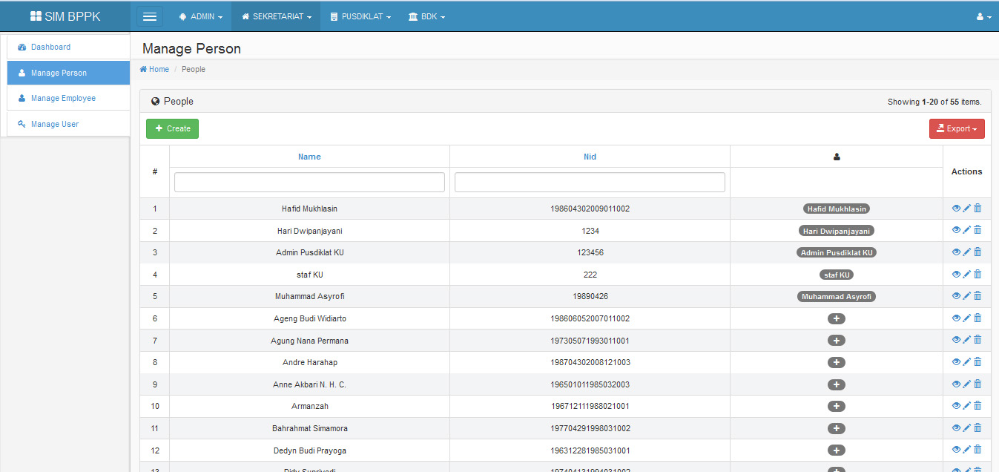
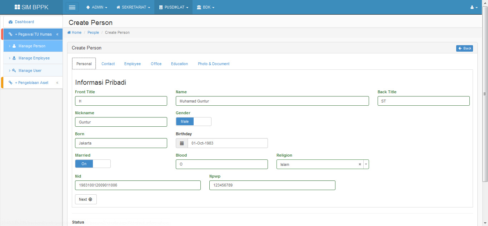

PUSDIKLAT -- GENERAL -- PEGAWAI TU HUMAS
----------

	
# Manage Person #
Merupakan menu yang disediakan untuk mengelola data Pegawai dan data pengelola Aplikasi SIM BPPK (PIC dan Administrator)

 
- **Create -- Personal**

Create digunakan untuk membuat akun baru dengan halaman muka di **tab personal** yang berisikan nama, jenis kelamin, tanggal lahir, NPWP, dll.

- **Create -- Contact**

Halaman yang berisi informasi mengenai kontak pegawai, diantaranya no telepon, email, homepage, alamat, dll.

- **Create -- Employee**

Halaman yang berisi informasi kepegawaian user, NIP dan Rank Class.

- **Create -- Office**

Halaman yang berisi informasi mengenai tempat kerja user, diantaranya Posisi, unit kerja, no telepon kantor, dll.

- **Create -- Education**

Halaman yang berisi informasi pendidikan user yaitu jenjang pendidikan dan deskripsinya.

- **Create -- Photo & Document**

Halaman yang berisi informasi megenai photo user, SK CPNS, dan SK Pangkat.

**Action View, Update, Delete dan export**

Merupakan fitur yang digunakan untuk melakukan proses lihat data (Action View), edit data (Action Update),  hapus data (Action Delete) dan export data. Untuk export data terdapat beberapa pilihan, export ke HTML, CSV, Text dan excel.

- **Action View**

Fitur yang digunakan untuk melihat data user, seletah action view dipilih, maka akan menampilkan halaman berikut:

 
- **Action Delete**

Fitur yang digunakan untuk menghapus data user, setelah action delete dipilih, maka akan muncul pesan "Are you sure to delete this item?", bila yang dipilih OK, maka data akan terhapus, namun bila yang dipilih cancel, maka data tidak jadi dihapus.

- **Action Update**

Merupakan Fitur yang digunkan untuk melakukan updating data. Gambar tampilan dari Action Update sama dengan gambar tampilan pada fitur create.

- **Export HTML**

Export HTML digunakan untuk mengexport data ke dalam bentuk HTML, pilihan export data lainnya adalah dalam bentuk CSV, Text dan Excel.

# Manage Employee #
Manage employee digunakan untuk mengelola user berdasarkan unit asal (Pusdiklat, BDK dan Sekretariat), pada manage employee terdapat fitur action view (untuk melihat data), update (untuk mengedit data), delete (untuk menghapus data) dan export (export HTML, CSV, Text dan Excel).

- **Person ID**

untuk melihat detail data pada person ID dapat dilkukan dengan memilih salah satu fieldnya, misalnya pilih Hafid, maka akan menampilkan halaman berikut:

- **User ID**

untuk melihat detail data pada USer ID dapat dilakukan dengan memilih salah satu fiel pada kolom User ID, misalnya admin, maka akan menampilkan halaman berikut:

- **Action View**

Fitur yang digunakan untuk melihat data user, seletah action view dipilih, maka akan menampilkan halaman berikut:

- **Action Update**

Merupakan Fitur yang digunkan untuk melakukan updating data, setelah action update dipilih, maka akan menampilkan halaman berikut:

- **Action Delete**

Fitur yang digunakan untuk menghapus data user, setelah action delete dipilih, maka akan muncul pesan "Are you sure to delete this item?", bila yang dipilih OK, maka data akan terhapus, namun bila yang dipilih cancel, maka data tidak jadi dihapus.

- **Export HTML**

Export HTML digunakan untuk mengexport data ke dalam bentuk HTML, pilihan export data lainnya adalah dalam bentuk CSV, Text dan Excel.

# Manage User #
Manage User digunakan untuk mengelola user berdasarkan hak akses terhadap aplikasi SIM BPPK, pada manage User terdapat fitur action view (untuk melihat data), update (untuk mengedit data), delete (untuk menghapus data) dan export (export HTML, CSV, Text dan Excel).

- **Action View**

Fitur yang digunakan untuk melihat data user, seletah action view dipilih, maka akan menampilkan halaman berikut:

- **Action Update**

Merupakan Fitur yang digunkan untuk melakukan updating data, setelah action update dipilih, maka akan menampilkan halaman berikut:

- **Action Delete**

Fitur yang digunakan untuk menghapus data user, setelah action delete dipilih, maka akan muncul pesan "Are you sure to delete this item?", bila yang dipilih OK, maka data akan terhapus, namun bila yang dipilih cancel, maka data tidak jadi dihapus.

- **Export HTML**

Export HTML digunakan untuk mengexport data ke dalam bentuk HTML, pilihan export data lainnya adalah dalam bentuk CSV, Text dan Excel.

