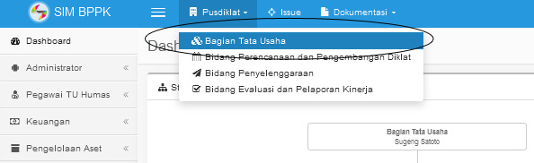

# PUSDIKLAT #

## PUSDIKLAT - BAGIAN TATA USAHA ##

Pilih Menu Bar Pusdiklat | Bagian Tata usaha

- Struktur Oraganisasi Bagian Tata usaha

Untuk melihat struktur organisasi dari Bagian Tata Usaha, pilih sidebar Dashboard

- Manajemen Individu

Pilih sidebar Pegawai TU Humas | Manajemen Individu

- Create Individu

Masukan data individu, dengan field yang wajib diisi adalah Nama, NID (sementara isi dengan NIP) dan Status, Klik Next Next dan Next hingga menjumpai tab terakhir, Klik Create

- Update dan delete individu
 untuk melakukan update data individu atau menghapus data dapat dilakukan dengan memilih salah satu menu pada kolom action.

Ketika menginput data Individu maka otomatis data pegawai dan data user akan tercipta. Sehingga pegawai sudah langsung bisa login menggunakan username NIP, dan password NIP juga

**Assignment User**

Merupakan fitur yang digunakan untuk mengatur hak akses user, dengan tampilan berikut ini:

Kemudian pilih action edit, maka akan menampilkan halaman dibawah ini, pengaturan hak akses terletak pada field role, kemudian pilih tombol update.

**Pengelolaan Aset**

1. Manajemen Ruangan 

Merupakan menu yang disediakan untuk mengelola ruangan baik untuk kegiatan diklat maupun rapat, pilih sidebar Pengelolaan Aset | Manajemen Ruangan

- Create Room

Untuk membuat/menambah daftar ruangan, pilih menu create, kemudian isilah field-field yang disediakan (kode ruangan, nama ruangan, kapasitas ruangan, lokasi, serta field-field isian lainnya), kemudian pilih tombol create.

- Approve Ruangan

Untuk approve ruangan, pilih salah satu field pada kolom internal atau external

 
Kemudian pilih action edit

Pilih Approve, kemudian pilih tombol update.

## PUSDIKLAT - BIDANG PERENCANAAN DAN PENGEMBANGAN DIKLAT ##

**Dashboard Bidang Perencanaan dan Pengambangan Diklat**

menampilkan halaman struktur organisasi dari Bidang Perencanaan dan Pengembangan Diklat

**A. Subbidang Program**

**1. Pengelolaan Program **

**- Create Program**

Untuk membuat program diklat baru, pada sidebar pilih Program | Program  kemudian pilih tombol create seperti gambar dibawah ini

Masukan data program diklat yang akan dibuat, seperti number/kode program, nama program, waktu/lama diklat (dalam bentuk jam dan hari), menggunakan test atau tidak dan pilihan kategori diklat, kemudian pilih tombol create.

untuk melakukan update, delete dan read program dapat dilakukan dengan memilih salah satu icon pada kolom action 

**2. Validasi Program **

Untuk melakukan validasi program diklat, pilih salah satu field yang terdapat dalam kolom validate

Kemudian pilih validation statusnya, apakah draft, process, valid atau reject, Kemudian pilih tombol update 

**3. Pengelolaan Diklat**

- Create diklat

Untuk membuat diklat baru, pada sidebar pilih Program | Diklat, kemudian pilih tombol create seperti gambar dibawah ini 

Masukan data diklat yang akan dibuat seperti nama diklat, tanggal pelaksanaan diklat, lokasi, diasramakan atau tidak, kmudian pindah ke halaman beriktunya dengan memilih tombol next, kemudian dilanjutkan dengan mengisi jumlah peserta serta jumlah kelas yang akan dilaksanakan dan field isian lainnya, apabila sudah selesai kemudian plih tombol create.

untuk melakukan update, delete dan read serta untuk mengetahui histori tentang revisi/updating diklat dapat dilakukan dengan memilih salah satu icon pada kolom action 

**4. Status Diklat (Validasi Diklat)**

Untuk melakukan validasi diklat (mengubah status diklat) dapat dilakukan dengan memilih action edit kemudian memilih status diklat tersebut, apakah plan, ready, atau cancel.

Pilih tombol next, kemudian pilih tombol update atau update as revision, update as revision ini artinya jika menginginkan agar data lama tetap tersimpan dalam history. Fungsi ini sebaiknya digunakan apabila perubahan yang dilakukan memang sangat mendasar atau signifikan. Adapun perubahan kecil seperti salah penulisan atau ejaan, maka cukup gunakan fungsi Update saja. 

**5. Sebaran Peserta**

Untuk membuat sebaran peserta dapat dilakukan dengan memilih field pada kolom student.

Untuk memasukan data sebaran peserta dengan memilih action edit

Kemudian masukanlah data sebaran pesertanya, kemudian pilih tombol update.

**B. Subbidang Kurikulum**

**1. Input Mata Pelajaran**

Untuk membuat mata pelajaran dalam program diklat dapat dilakukan dengan memilih sidebar Kurikulum | Program, kemudian pilih field pada kolom MP.

Pilih create untuk membuat mata pelajaran baru, kemudian isilah field tipe, nama mata pelajaran, jumlah jam dan pilihan test atau tidak, kemudian pilih tombol save.

untuk mengupdate dan menghapus data mata pelajaran dapat dilakukan dengan memilih salah satu ikon pada menu action

**C. Subbidang Tenaga Pengajar**

**1. Manajemen Pengajar**

Manajemen pengajar digunakan untuk mengelola data pengajar diklat dengan memilih sidebar Tenaga Pengajar | Manajemen Pengajar

- Create Tenaga Pengajar

untuk membuat/menambah tenaga pengajar dapat dilakukan dengan memilih tombol create, kemudian akan menampilkan halaman dibawah ini.
Pilih salah satu field pada kolom trainer untuk menseting tenaga pengajar (seting as trainer) bila field berwarna kuning artinya orang tersebut belum diset sebagai tenaga pengajar, bila field berwarna hijau artinya orang tersebut telah diset sebagai tenaga pengajar. Ketika menseting tenaga pengajar akan mmuncul pesan berupa "Apakah anda yakin people yang dipilih akan dijadikan sebagai tenaga pengajar?"

**2. Set Pengajar Untuk Mata Pelajaran**

Untuk menseting pengajar dalam mata pelajaran tertentu dapat dilakukan dengan memilih sidebar Tenaga Pengajar | Diklat, kemudian pilih salah satu field pada kolom MP seperti pada gambar dibawah ini:

Kemudian pilih salah satu field pada kolom trainer

Pilih Recomendation 

Kemudian pilih salah satu tenaga pengajar yang diinginkan

Kemudian pilih tipe tenaga pengajar, kemudian klik ikon "ya saya yakin!" 

Untuk melakukan update, delete dan read data dapat dilakukan dengan memilih salah satu ikon pada menu action.

**3. Tambah Data Pengajar Baru**

Pilih tombol tambah data pengajar baru, disini akan muncul pesan berupa "Apakah Anda yakin akan menambah data pengajar baru! pastikan tidak terjadi duplikasi data!", hal ini untuk meyakinkan user agar tidak terjadi duplikasi data. 

Kemudian masukan data pengajar baru, hingga tab/halaman terakhir, kemudian pilih tombol create.

## PUSDIKLAT - BIDANG PENYELENGGARAAN ##

**Dashboard Bidang Penyelenggaraan**

Menampilkan halaman struktur organisasi dari Bidang Penyelenggaraan Diklat

**A. Subbidang Penyelenggaraan I**

- Mengubah Status Diklat

Untuk mengubah status diklat pilih sidebar Penyelenggaraan I | Diklat, kemudian pilih ikon edit pada kolom action 

Kemudian pilih status "execute", klik next kemudian klik tombol update

Kemudian akan muncul halaman berikut, dengan penambahan icon di kolom action, kemudian pilih ikon tersebut

Akan menampilkan halaman berikut

**1. Pengelolaan Peserta** 

- Daftarkan Peserta

Untuk mendaftarkan peserta dapat dilakukan dengan memilih dashboard berwarna hijau yang bertuliskan student

 

Kemudian upload data peserta sesuai dengan template yang telah disediakan, kemudian klik tombol import excel

Akan menampilkan halaman berikut, kemudian pada sisi paling kanan pilih check box dan pada halaman kanan bawah pilih tombol submit

Peserta telah terdaftar

- Update, delete dan Read Peserta

Untuk melakukan update, delete dan read data peserta pilih sidebar Penyelenggaraan I | Manajemen Peserta, kemudian pilih salah satu ikon pada kolom action

**2. Pengelolaan Room (Ruangan)** 

Untuk menset ruangan untuk kegiatan diklat, pilih dashboard Class

Pilih Action Set (click to set it), maka akan masuk kedalam list of booked room, untuk menambah liast booked room dapat mengklik tombol +Booking Room.

**3. Pengelolaan Kelas** 

Untuk menset kelas pilih dashboard class

Kemudian akan muncul halaman berikut:

1. Pilih tombol create untuk mebuat kelas
2. Masukan jumlah peserta diklat
3. Pilih Set berdasarkan (nama, gender dan unit), kemudian klik tombol get
4. Klik Subject untuk memasukkan mata pelajaran dalam kegiatan diklat
5. Klik Schedule untuk membuat jadwal diklat

kemudian isi semua field (Choose Activity dan Hours) kemudian klik ikon 'tambah' (+), ulangi langkah ini hingga semua mata pelajaran masuk kedalam jadwal diklat.

6. Set Trainer

Untuk menseting trainer/tenaga pengajar dilakukan dengan memilih salah satu field pada kolom PIC/Narasumber, kemudian klik field pada kolom set, pilih tombol add.

PIC/Narasumber sudah terseting

7. Set Room 

Untuk menseting ruangan yang akan dilaksanakan pada kegiatan diklat dilakukan dengan memilih salah satu field pada kolom Room, kemudian pilih room yang diinginkan, kemudian pilih tombol update.

8. Jadwal Diklat

Jadwal diklat dapat diexport kedalam file excel dengan memilih tombol jadwal diklat.

**B. Subbidang Penyelenggaraan II**

- Input dan Cetak Dokumen Kehadiran Peserta dan pengajar

Untuk mencetak rekap kehadiran peserta dan pengajar

1. Pilih Penyelenggaraan II | Diklat, kemudian pilih menu action seperti gambar dibawah ini:

2. Pilih Dashboard Class

3. Pilih salah satu menu di kolom attendance (Input Data Kehadiran Peserta dan Pengajar, Cetak Rekap Kehadiran Peserta Pada Kelas Ini, dan Cetak Rekap Kehadiran Pengajar Pada Kelas Ini)

- Input Data Kehadiran Peserta dan Pengajar, untuk melakukan input data peserta atau pengajar pilih salah satu ikon pada kolom action.

- Input Data Pengajar 

Default kehadiran adalah 100% dari jadwal yang telah ditentukan, apabila ada pengajar dengan kehadiran kurang dari jadwal yang telah ditentukan, maka langsung dilakukan edit di kolom kehadiran 

- Input Data Peserta

- Print rekap kehadiran dan form kehadiran (Print Attendance Recapitulation for this class dan Print Form Attendance)

## PUSDIKLAT - BIDANG EVALUASI DAN PELAPORAN KINERJA ##

**Dashboard Bidang Evaluasi dan Pelapran Kinerja**

Menampilkan halaman struktur organisasi dari Bidang Evaluasi dan Pelaporan Kinerja

**A. Subbidang Evaluasi Diklat**

Menampilkan tabel diklat mualai dari tanggal pelaksanaan diklat, jumlah peserta, PIC, Status, dan beberapa menu action yang terdiri dari dashboard diklat, input realisasi biaya, input nilai kehadiran, input nilai aktivitas, input nilai pre test, input nilai post test, dan cetak rekapitulasi nilai.

- Input Realisasi Biaya
Pada kolom action pilih menu input realisasi biaya, kemudian masukan realisasi biaya yang dikeluarkan.

- Input Nilai Kehadiran
Pada kolom action pilih menu input nilai kehadiran

- Input Nilai Aktivitas
Pada kolom action pilih menu input nilai aktivitas

- Input Nilai Pre Test
Pada kolom action pilih menu input nilai pre test

- Input Nilai Post Test
Pada kolom action pilih menu input nilai post test

- Cetak Rekapitulasi Nilai
Pada kolom action pilih menu cetak nilai kehadiran, aktivitas, pre test dan post test.

**Subbidang Pengelolaan Hasil Diklat**

- Input Nilai Akhir

Pada kolom action pilih menu input nilai akhir, kemudian masukan nilai akhir

- Cetak Nilai Akhir
Pada kolom action pilih menu cetak nilai akhir 

